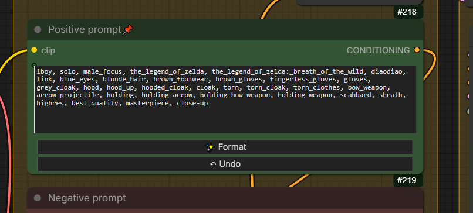
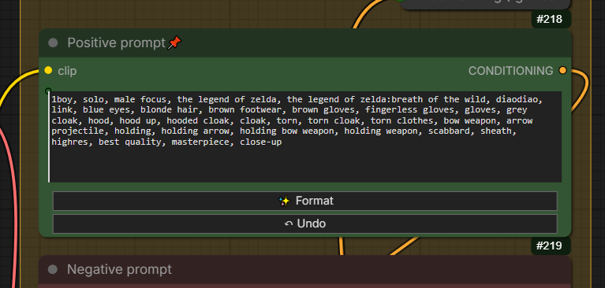
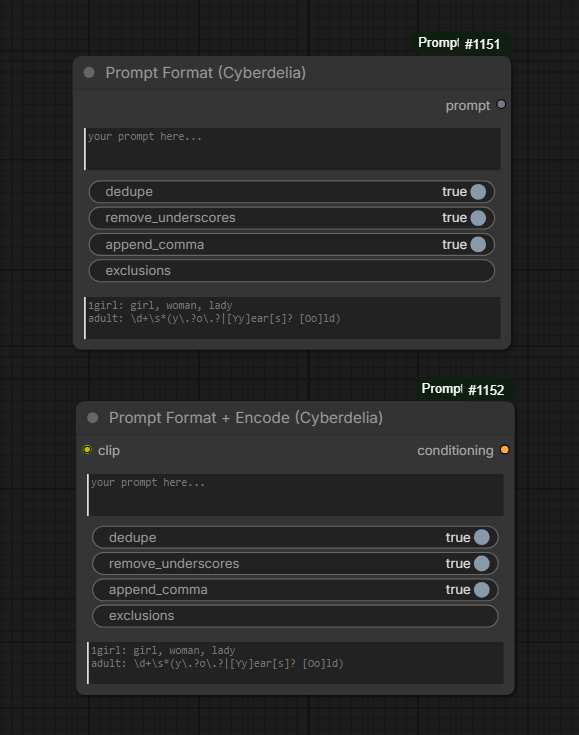
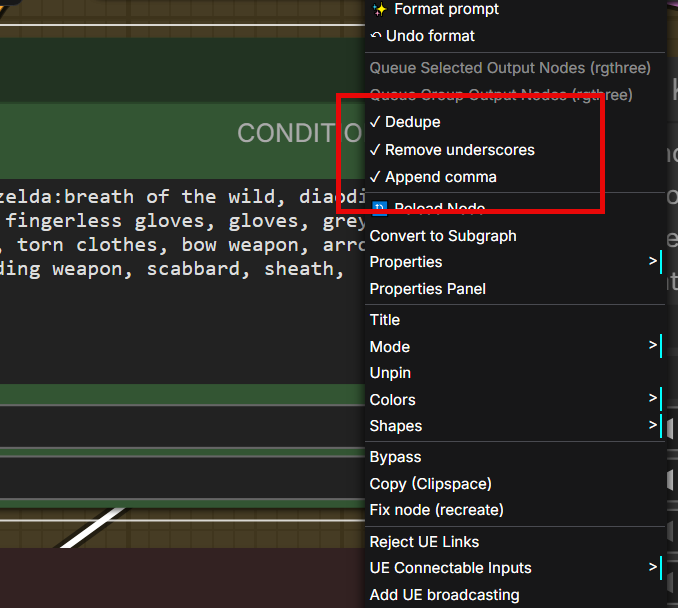

# comfyui-cyberdelia-prompt-format

Prompt cleanup for ComfyUI.

By **Cyberdelia AI Lab** · [github.com/cyberdeliaAI](https://github.com/cyberdeliaAI)

> **Migration notice**
>
> This package was previously published as [`ComfyUI-PromptFormat`](https://github.com/cyberdeliaAI/ComfyUI-PromptFormat). The repository has been renamed for consistency with the rest of the Cyberdelia ComfyUI ecosystem. Node class names (`CyberdeliaPromptFormat`, `CyberdeliaPromptFormatEncode`) and display names are unchanged, so existing workflows continue to work — just reinstall under the new name.

## Before / After

One click on `✨ Format` turns this:



...into this:



Note how `the_legend_of_zelda:_breath_of_the_wild` becomes `the legend of zelda:breath of the wild`, duplicates like `gloves` are removed, and colon spacing is tightened — without touching your tag weights or brackets.

## What it does

- **Dedupe tags** — removes duplicates, with optional regex-based aliases (e.g. `1girl: girl, woman, lady`).
- **Remove underscores** — `long_hair` → `long hair`, except for embedding filenames and user-excluded tags (e.g. `score_9`).
- **Fix spacing** — normalizes commas and spaces around `()`, `[]`, `{}`, `|`, `:`.
- **Append commas** — trailing commas on multi-line prompts, so you can break lines without breaking prompts.
- **Strips `<lora:...>` syntax** — ComfyUI uses LoRA loader nodes; inline LoRA tags are dropped.

## Two ways to use it

### 1. The nodes — automatic formatting on run



- **Prompt Format (Cyberdelia)** — string → string. Drop it between any text source and your text encoder.
- **Prompt Format + Encode (Cyberdelia)** — string + CLIP → CONDITIONING. Combines formatting and CLIP encoding in one step.

Both nodes format **automatically when the workflow executes** — no button to click. Use these when you want deterministic, reproducible output baked into your workflow, and when you need full control (exclusions, regex aliases).

### 2. The ✨ Format button — for existing encoder nodes

A `✨ Format` and `↶ Undo` button is injected into the stock text encoder nodes, so you can clean up prompts in place without adding a node to the graph:

- `CLIPTextEncode`
- `CLIPTextEncodeSDXL` / `CLIPTextEncodeSDXLRefiner`
- `CLIPTextEncodeFlux`
- `BNK_CLIPTextEncodeAdvanced` and `smZ CLIPTextEncode`

Right-click for per-node-type toggles (dedupe / remove underscores / append comma), stored in localStorage. Exclusions and aliases aren't exposed on foreign nodes — if you need those, chain a `Prompt Format` node instead.



Formatting is **not realtime** in either case. The button runs on click; the node runs on workflow execute.

## Installation

### Manual

```bash
cd ComfyUI/custom_nodes
git clone https://github.com/cyberdeliaAI/comfyui-cyberdelia-prompt-format
```

Restart ComfyUI. No extra dependencies.

## Aliases (regex syntax)

Same format as the Forge extension:

```
main_tag: alt1, alt2, regex_pattern
1girl: girl, woman, lady
adult: \d+\s*(y\.?o\.?|[Yy]ear[s]? [Oo]ld)
```

Each alternate on the right is matched as an **anchored regex** against each cleaned tag; if it matches, the tag is replaced by `main_tag` and considered a duplicate from then on.

## Exclusions

Comma-separated list of tags to protect from underscore replacement:

```
score_9, score_8_up, score_7_up, masterpiece_v2
```

Embedding filenames in your `embeddings/` folder are auto-detected and always protected.
